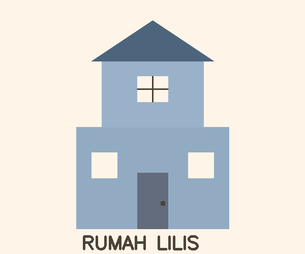

# UTS COMPUTER VISION  
### Nama: Lilis Anggraeni  
### NIM: 43050230009  

## Karakter yang Dibuat
Karakter yang dibuat adalah rumah sederhana bernama **"Rumah Lilis"** dengan ciri-ciri:
- Dinding berwarna biru muda
- Atap segitiga berwarna biru tua
- Pintu biru tua dengan gagang hitam  
- Tiga jendela putih  
- Tulisan “RUMAH LILIS” di bagian bawah  

Gambar dibuat menggunakan fungsi-fungsi OpenCV:
- `cv2.rectangle()` untuk dinding, pintu, dan jendela  
- `cv2.fillPoly()` untuk atap  
- `cv2.line()` untuk sekat jendela  
- `cv2.circle()` untuk gagang pintu  
- `cv2.putText()` untuk teks  

Hasil awal disimpan dengan nama **output/karakter.png**

---

## Transformasi yang Diterapkan
1. **Translasi**  
   Menggeser posisi rumah sejauh (x=60, y=40) piksel.  
   → Disimpan sebagai `output/translate.png`

2. **Rotasi**  
   Memutar rumah sebesar 25° terhadap pusat gambar.  
   → Disimpan sebagai `output/rotate.png`

3. **Resize**  
   Mengubah ukuran gambar menjadi 300x250 piksel.  
   → Disimpan sebagai `output/resize.png`

4. **Crop**  
   Memotong bagian tengah rumah agar fokus pada area utama.  
   → Disimpan sebagai `output/crop.png`

---

## Operasi Aritmatika dan Bitwise
1. **Bitwise AND**  
   Menggabungkan rumah dengan background biru muda.  
   → Disimpan sebagai `output/bitwise.png`

2. **AddWeighted**  
   Menggabungkan rumah dengan background menggunakan efek transparansi 70% : 30%.  
   → Disimpan sebagai `output/final.png`

   ---

## Screenshot Hasil

